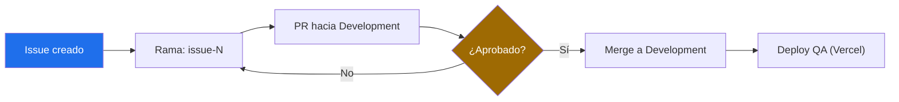
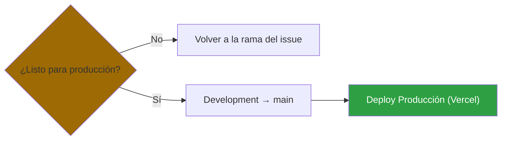

# Guía de contribución

Este documento define el flujo de trabajo obligatorio para contribuir a este repositorio. Aplica a todos los colaboradores.

## Reglas generales

- **`main`** es la rama de **producción**. Está protegida: nadie puede hacer push directo ni abrir PR hacia ella salvo el administrador del repositorio.
- **`Development`** (con mayúscula inicial, tal cual) es la rama de **QA**. Todo el trabajo de los colaboradores se dirige aquí. También está protegida: no se puede hacer push directo, todo entra por PR.
- Ningún colaborador puede apuntar un Pull Request directamente a `main`.
- El paso de `Development` a `main` es responsabilidad exclusiva del administrador, una vez que los cambios fueron validados en QA.
- El gestor de paquetes es **pnpm**. No uses `npm` ni `yarn`: generan un lockfile paralelo al `pnpm-lock.yaml` y ensucian el diff.

## Flujo de trabajo

1. **Crea una rama por cada issue**, partiendo desde `Development` actualizada:
   `git fetch origin Development && git checkout -b issue-N origin/Development`.
2. **Nombra la rama con el identificador del issue**, en el formato `issue-N` (ejemplo: `issue-3`).
3. Realiza tus cambios y commits en esa rama. Antes de subir: `pnpm lint` y `pnpm exec tsc --noEmit`.
4. Abre un **Pull Request hacia `Development`** (nunca hacia `main`).
5. El PR requiere **al menos 1 aprobación de un Code Owner** antes de poder mergearse.
6. Una vez aprobado, se hace merge a `Development`, donde se despliega automáticamente a Vercel (entorno QA).
7. **Cierra el issue a mano** tras el merge: `gh issue close N --comment "Resuelto en PR #M."`. El `Closes #N` del PR **no** lo cierra solo, porque GitHub solo procesa esa palabra clave contra la rama por defecto (`main`) y aquí mergeamos a `Development`.
8. Cuando el administrador valida que `Development` está estable, realiza el pase a `main`, desplegando a producción.

Para ver un preview en Vercel no hace falta abrir el PR: basta con hacer push de
la rama.

## Flujograma

**Fase QA — Colaboradores**
 

 
**Fase Producción — Solo Admin**
 

## Resumen de restricciones por rama

| Rama | Quién puede apuntar PR aquí | Requiere aprobación | Push directo |
|---|---|---|---|
| `Development` | Todos los colaboradores | Sí, 1 Code Owner | No |
| `main` | Solo el administrador | No | No |

## Buenas prácticas

- Mantén tu rama `issue-N` actualizada con `Development` antes de abrir el PR, para evitar conflictos.
- Un PR debe resolver un único issue. No mezcles cambios de distintos issues en la misma rama.
- Antes de tomar un issue nuevo, revisa los PRs abiertos (`gh pr list --state open`, `gh pr diff N --name-only`). Si el archivo que vas a tocar ya está en un PR sin mergear, espera a que se mergee: es un conflicto seguro aunque el PR sea tuyo.
- Verifica que el bug siga existiendo en el código actual antes de implementarlo. El texto de un issue puede estar desactualizado: varios se resolvieron de rebote en PRs anteriores.
- Si tu PR es rechazado o se piden cambios, súbelos como nuevos commits en la misma rama; no cierres el PR.
