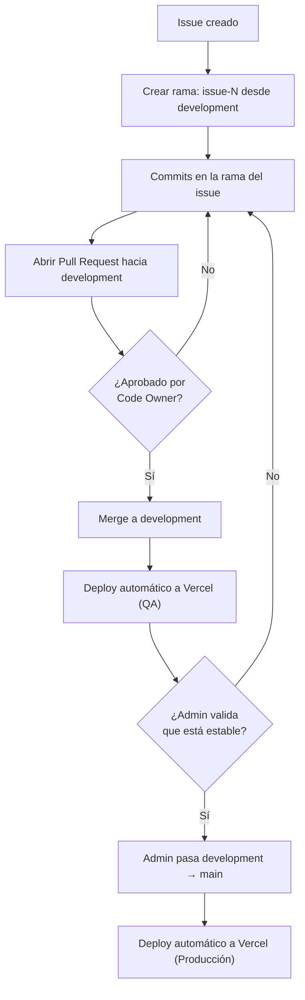

# Guía de contribución

Este documento define el flujo de trabajo obligatorio para contribuir a este repositorio. Aplica a todos los colaboradores.

## Reglas generales

- **`main`** es la rama de **producción**. Está protegida: nadie puede hacer push directo ni abrir PR hacia ella salvo el administrador del repositorio.
- **`development`** es la rama de **QA**. Todo el trabajo de los colaboradores se dirige aquí.
- Ningún colaborador puede apuntar un Pull Request directamente a `main`.
- El paso de `development` a `main` es responsabilidad exclusiva del administrador, una vez que los cambios fueron validados en QA.

## Flujo de trabajo

1. **Crea una rama por cada issue**, partiendo desde `development` actualizada.
2. **Nombra la rama con el identificador del issue**, en el formato `issue-N` (ejemplo: `issue-3`).
3. Realiza tus cambios y commits en esa rama.
4. Abre un **Pull Request hacia `development`** (nunca hacia `main`).
5. El PR requiere **al menos 1 aprobación de un Code Owner** antes de poder mergearse.
6. Una vez aprobado, se hace merge a `development`, donde se despliega automáticamente a Vercel (entorno QA).
7. Cuando el administrador valida que `development` está estable, realiza el pase a `main`, desplegando a producción.

## Flujograma

## Resumen de restricciones por rama

| Rama | Quién puede apuntar PR aquí | Requiere aprobación | Push directo |
|---|---|---|---|
| `development` | Todos los colaboradores | Sí, 1 Code Owner | No |
| `main` | Solo el administrador | N/A (gestión manual) | No |

## Buenas prácticas

- Mantén tu rama `issue-N` actualizada con `development` antes de abrir el PR, para evitar conflictos.
- Un PR debe resolver un único issue. No mezcles cambios de distintos issues en la misma rama.
- Si tu PR es rechazado o se piden cambios, súbelos como nuevos commits en la misma rama; no cierres el PR.
